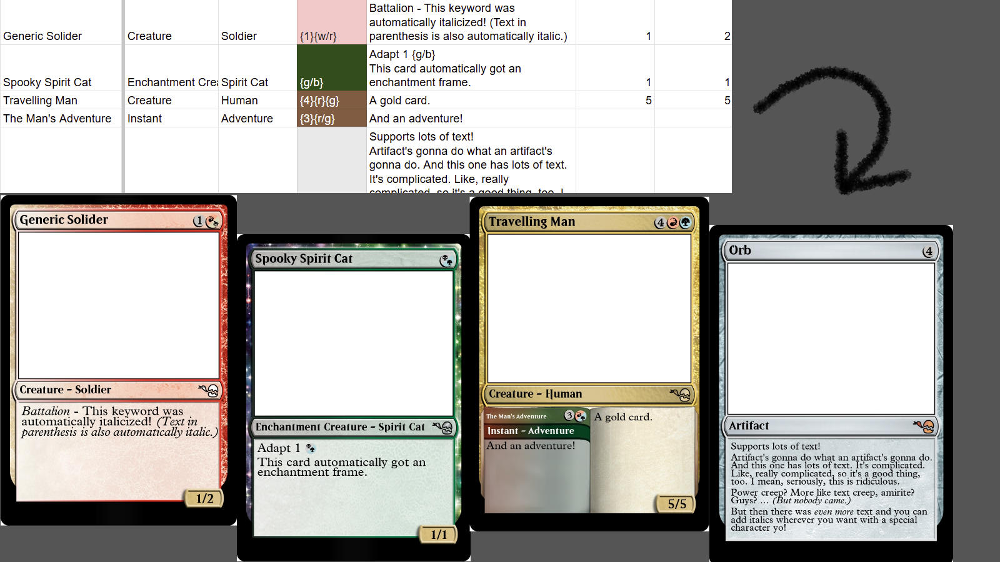

ChickenSnake 🥚🐍
=
ChickenSnake is a scrappy script to convert **spreadsheets** of custom MtG cards into images and metadata for **[Cockatrice](https://cockatrice.github.io/)** and **[Draftmancer](https://draftmancer.com/)** to use.

 
Usage
=
The only thing you'll need is a spreadsheet of custom card data.
For specifics of using ChickenSnake, **[refer to the manual](https://docs.google.com/document/d/1O9GpJip-OzPRiNJBgQ4u302_vP5TWEYqoMZcFQbSOGs/edit?usp=sharing)**.

For Windows users, simply open the BUILD folder and place your spreadsheet in its Inputs folder. Put the spreadsheet's name in the JSON file and just run *ChickenSnake.exe*. 

For non-Windows users, you'll need Python installed. Then you can download the files found in SRC and run *python ChickenSnake.py* from the console after configuring the JSON file as mentioned above. Again, please **[refer to the manual](https://docs.google.com/document/d/1O9GpJip-OzPRiNJBgQ4u302_vP5TWEYqoMZcFQbSOGs/edit?usp=sharing)**.
 

You can see an example of a card data spreadsheet [here](https://docs.google.com/spreadsheets/d/1YssDJAmf62y4FMoJEfTghtmgNZoqKLyvvz7d445Cqjk/edit?usp=sharing).
Opening *settings.json* will allow you to configure ChickenSnake's behavior. 

Credits
=
Built for **[Cockatrice](https://cockatrice.github.io/)** and **[Draftmancer](https://draftmancer.com/)**. Continued effort here was facilited by their existances!
 None of the fonts are mine. 
 Used PIL and some built-in Python modules. 
 Built for Windows-Ease with PyInstaller!